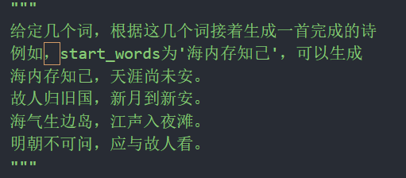
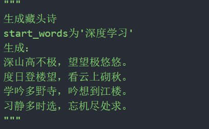
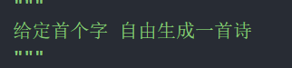
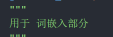

基于Transformer的唐诗宋词生成器 作词家   Web界面(Dash构建)

## 直接使用 安装依赖后 运行Webshow.py


### A.界面展示


### B.功能支持：









### 1.项目依赖

见 requirements.txt   

```python
pip install -r requirements.txt  
```


### 2.数据采集

chinese_poetry下包含 唐诗宋词的原始的json数据集文件 数据参照来源如下

Data：https://github.com/chinese-poetry/chinese-poetry

### 3.数据清洗

数据清洗文件见data_process.py 

数据清洗后的data,word2ix,ix2word数据存放在data文件夹下 npz格式

### 4.训练

configs.py为参数配置文件

model.py定义模型的结构部分（位置编码以及参数初始化等）

sample.py文件用于测试模型的生成效果 定义了生成的函数

（支持藏头诗生成，给定首句生成，给定首字生成，给定词进行嵌入生成）

train.py为训练代码

```python
opt=opt_shi
data,word_to_ix,ix_to_word = data_process.optimize_get_data(opt)
#此时为训练唐诗的模型代码 训练宋词同理
```

### 5.部署

Webshow.py 运行后打开浏览器 部分浏览器需要调整一下界面大小（前端水平一般。。。）

